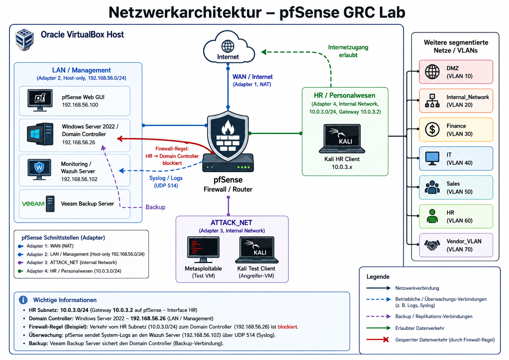

# Enterprise-IT-Administrator-Lab


## Windows Server | Active Directory | pfSense | Monitoring | Backup | GRC Documentation

## Projektübersicht / Project Overview

This project demonstrates a practical enterprise-style IT administration lab environment built with virtualization technologies. The lab simulates common tasks performed by an IT Administrator, System Administrator, IT Support Specialist, and GRC-oriented Infrastructure Administrator.

Dieses Projekt zeigt eine praxisnahe Enterprise-IT-Administrator-Lab-Umgebung, die mit Virtualisierungstechnologien aufgebaut wurde. Das Lab simuliert typische Aufgaben eines IT-Administrators, Systemadministrators, IT-Support-Spezialisten sowie eines GRC-orientierten Infrastruktur-Administrators.

The main focus areas are Windows Server administration, Active Directory, Group Policy Objects, file server access control, network segmentation with pfSense, monitoring, backup and restore, and technical documentation.

Die Schwerpunkte liegen auf Windows-Server-Administration, Active Directory, Gruppenrichtlinien, Dateiserver-Zugriffskontrolle, Netzwerksegmentierung mit pfSense, Monitoring, Backup und Restore sowie technischer Dokumentation.

---

## Ziel des Projekts / Project Objective

The objective of this lab is to demonstrate hands-on IT administration skills in a structured and documented environment.

Ziel dieses Labs ist es, praktische IT-Administrationskenntnisse in einer strukturierten und dokumentierten Umgebung nachzuweisen.

The project is designed to show the ability to:

Das Projekt zeigt die Fähigkeit:

* install and configure Windows Server environments
* manage Active Directory users, groups and organizational units
* configure Group Policy Objects
* implement file server access control
* configure network segmentation with pfSense
* validate firewall rules through practical tests
* set up monitoring for infrastructure systems
* configure backup and restore processes
* document IT processes professionally
* apply basic security, compliance and GRC principles

---

## Lab Architecture / Lab-Architektur

The lab is built using Oracle VirtualBox and consists of multiple virtual machines representing a small enterprise IT environment.

Das Lab wurde mit Oracle VirtualBox aufgebaut und besteht aus mehreren virtuellen Maschinen, die eine kleine Unternehmens-IT-Umgebung simulieren.

### Main Components

| Component           | Purpose                                              |
| ------------------- | ---------------------------------------------------- |
| Windows Server 2022 | Active Directory, DNS, File Server, Group Policy     |
| Windows Client      | Domain client for testing policies and access rights |
| pfSense Firewall    | Routing, firewall rules, segmentation, DHCP          |
| Kali Linux          | Test client and security testing machine             |
| Ubuntu Server       | Monitoring / SIEM / infrastructure services          |
| Checkmk / Wazuh     | Monitoring and log analysis                          |
| Veeam Backup Server | Backup and restore testing                           |
| VirtualBox          | Virtualization platform                              |

---

## Network Architecture / Netzwerkarchitektur

The environment is segmented into multiple network zones to simulate an enterprise network.

Die Umgebung ist in mehrere Netzwerkzonen segmentiert, um ein Unternehmensnetzwerk nachzubilden.

### Main Network Zones

| Network Zone       | Purpose                              | Example                 |
| ------------------ | ------------------------------------ | ----------------------- |
| LAN / Management   | Server and management network        | 192.168.56.0/24         |
| HR / Personalwesen | HR client network                    | 10.0.3.0/24             |
| DMZ                | Isolated network for exposed systems | VLAN / internal network |
| Finance            | Sensitive finance network            | VLAN / internal network |
| IT                 | Administrative network               | VLAN / internal network |
| ATTACK_NET         | Security testing network             | Kali / Metasploitable   |

### Example IP Addresses

| System                             | IP Address     |
| ---------------------------------- | -------------- |
| pfSense Web GUI                    | 192.168.56.100 |
| Windows Server / Domain Controller | 192.168.56.26  |
| HR Gateway on pfSense              | 10.0.3.2       |
| Kali HR Client                     | 10.0.3.x       |
| Monitoring / Wazuh Server          | 192.168.56.102 |

---

## Network Architecture Diagram



The architecture diagram shows the VirtualBox host environment, pfSense firewall/router, Windows Server, HR client network, monitoring server, Veeam backup server and segmented networks such as DMZ, Finance, IT, Sales and Vendor VLAN.

Das Architekturdiagramm zeigt die VirtualBox-Host-Umgebung, die pfSense-Firewall, den Windows Server, das HR-Client-Netzwerk, Monitoring, Veeam Backup sowie segmentierte Netzwerke wie DMZ, Finance, IT, Sales und Vendor VLAN.

---

## Repository Structure / Projektstruktur

```text
Enterprise-IT-Administrator-Lab/
│
├── README.md
├── diagrams/
│   └── Netzwerkarchitektur.png
│
├── docs/
│   ├── 01_Active_Directory/
│   ├── 02_File_Server_Access_Control/
│   ├── 03_GPO_Drive_Mapping/
│   ├── 04_Backup_and_Restore/
│   ├── 05_pfSense_Network_Segmentation/
│   ├── 06_VPN_Remote_Access/
│   ├── 07_Monitoring_and_Logs/
│   ├── 08_Microsoft_365_Entra_IAM/
│   ├── 09_Ticketing_Process/
│   └── 10_Audit_Documentation/
│
├── evidence/
│   ├── 01_Active_Directory/
│   ├── 02_File_Server_Access_Control/
│   ├── 03_GPO_Drive_Mapping/
│   ├── 04_Backup_and_Restore/
│   ├── 05_pfSense_Network_Segmentation/
│   ├── 06_VPN_Remote_Access/
│   ├── 07_Monitoring_and_Logs/
│   ├── 08_Microsoft_365_Entra_IAM/
│   ├── 09_Ticketing_Process/
│   └── 10_Audit_Documentation/
│
├── scripts/
│   ├── powershell/
│   └── bash/
│
└── templates/
    ├── audit_checklists/
    ├── risk_assessment/
    └── documentation_templates/
```

---

# Modules / Projektmodule

## 01 Active Directory Administration

This module demonstrates the installation and administration of Active Directory Domain Services.

Dieses Modul zeigt die Installation und Administration von Active Directory Domain Services.

### Implemented Tasks

* Installed Windows Server 2022
* Configured Active Directory Domain Services
* Created domain structure
* Created organizational units
* Created users and security groups
* Managed user memberships
* Applied role-based access structure

### Skills Demonstrated

* Windows Server administration
* Active Directory management
* User and group administration
* Organizational Unit design
* Role-based access control
* Basic identity and access management

---

## 02 File Server Access Control

This module demonstrates the configuration of a Windows File Server with NTFS and share permissions.

Dieses Modul zeigt die Konfiguration eines Windows-Dateiservers mit NTFS- und Freigabeberechtigungen.

### Implemented Tasks

* Created shared folders for departments
* Configured SMB shares
* Configured NTFS permissions
* Applied group-based access control
* Tested authorized and unauthorized access
* Documented access control results

### Example Departments

```text
HR
Finance
IT
Sales
```

### Skills Demonstrated

* File server administration
* NTFS permission management
* SMB share configuration
* Least privilege access
* Access control validation
* Security documentation

---

## 03 GPO Drive Mapping

This module demonstrates the use of Group Policy Objects to automatically map network drives for domain users.

Dieses Modul zeigt die Verwendung von Gruppenrichtlinien, um Netzlaufwerke automatisch für Domänenbenutzer zuzuordnen.

### Implemented Tasks

* Created a GPO for HR drive mapping
* Linked the GPO to the correct Organizational Unit
* Configured Drive Maps under Group Policy Preferences
* Tested GPO application on a client system
* Validated results using `gpupdate` and `gpresult`

### Example Configuration

```text
Network Share: \\WIN-JTS1CJ3NE68\HR
Drive Letter: H:
Target Group: HR users
```

### Skills Demonstrated

* Group Policy management
* Drive mapping
* Windows client administration
* Troubleshooting GPO application
* Enterprise user environment configuration

---

## 04 Backup and Restore

This module demonstrates backup and restore procedures using Windows Server Backup and Veeam Backup & Replication.

Dieses Modul zeigt Backup- und Restore-Prozesse mit Windows Server Backup und Veeam Backup & Replication.

### Implemented Tasks

* Created a backup repository
* Configured backup storage
* Installed Veeam Backup & Replication
* Created backup jobs
* Tested file-level restore
* Validated backup success

### Backup Test Scenario

```text
1. Create test file
2. Run backup job
3. Delete test file
4. Restore file from backup
5. Validate successful recovery
```

### Skills Demonstrated

* Backup planning
* Restore validation
* Veeam administration
* Disaster recovery basics
* Operational resilience
* IT documentation

---

## 05 pfSense Network Segmentation

This module demonstrates network segmentation using pfSense firewall rules.

Dieses Modul zeigt Netzwerksegmentierung mit pfSense-Firewall-Regeln.

### Implemented Tasks

* Configured pfSense interfaces
* Created segmented networks
* Configured DHCP for HR network
* Created firewall rules
* Blocked unauthorized traffic
* Allowed required communication
* Validated rules using ping tests
* Reviewed firewall logs

### Example HR Configuration

```text
HR Network: 10.0.3.0/24
pfSense HR Gateway: 10.0.3.2
Kali HR Client: 10.0.3.x
Domain Controller: 192.168.56.26
```

### Firewall Rule Example

```text
Action: Block
Interface: HR
Protocol: IPv4 Any
Source: HR net
Destination: 192.168.56.26
Description: Block HR to Domain Controller
```

### Validation

Allowed communication:

```bash
ping -c 4 10.0.3.2
```

Blocked communication:

```bash
ping -c 4 192.168.56.26
```

Expected blocked result:

```text
4 packets transmitted, 0 received, 100% packet loss
```

### Skills Demonstrated

* pfSense administration
* Firewall rule design
* Network segmentation
* Routing and gateway configuration
* DHCP configuration
* Packet filtering
* Troubleshooting
* Security validation

---

## 06 VPN Remote Access

This module is planned to demonstrate secure remote access using VPN technologies.

Dieses Modul ist geplant, um sicheren Remote-Zugriff mit VPN-Technologien zu demonstrieren.

### Planned Tasks

* Configure VPN service on pfSense
* Create VPN user access
* Test remote connection
* Validate access restrictions
* Document VPN configuration

### Skills Demonstrated

* Remote access security
* VPN basics
* pfSense VPN configuration
* Secure administration access

---

## 07 Monitoring and Logs

This module demonstrates infrastructure monitoring and log collection using Checkmk and Wazuh.

Dieses Modul zeigt Infrastruktur-Monitoring und Log-Erfassung mit Checkmk und Wazuh.

### Implemented Tasks

* Installed Checkmk monitoring server
* Created Checkmk site
* Added Linux host
* Installed Checkmk agent
* Added Windows Server host
* Installed Windows Checkmk agent
* Configured firewall access for monitoring
* Discovered services
* Activated monitoring changes

### Example Systems

```text
Monitoring Server: 192.168.56.24
Windows Server: 192.168.56.26
Checkmk Agent Port: 6556
```

### Skills Demonstrated

* Infrastructure monitoring
* Windows and Linux agent installation
* Service discovery
* Firewall port configuration
* System health monitoring
* Log review
* Troubleshooting

---

## 08 Microsoft 365 / Entra IAM

This module documents identity and access management concepts using Microsoft 365 and Microsoft Entra ID.

Dieses Modul dokumentiert Identity- und Access-Management-Konzepte mit Microsoft 365 und Microsoft Entra ID.

### Implemented / Planned Tasks

* User and group management
* MFA configuration
* Conditional Access review
* Admin role review
* Access review documentation
* Privileged Identity Management concepts

### Skills Demonstrated

* Cloud identity management
* Microsoft Entra ID basics
* MFA
* Conditional Access
* Access reviews
* Least privilege
* IAM documentation

---

## 09 Ticketing Process

This module documents a practical IT support ticketing process based on ITIL-oriented workflows.

Dieses Modul dokumentiert einen praxisnahen IT-Support-Ticketprozess auf Basis ITIL-orientierter Abläufe.

### Example Workflow

```text
1. Ticket received
2. Classification
3. Prioritization
4. Initial troubleshooting
5. Escalation if required
6. Resolution
7. Documentation
8. Closure
```

### Example Ticket Categories

* Password reset
* Account locked
* Network issue
* Printer issue
* Software installation
* Access request
* Backup failure
* Monitoring alert

### Skills Demonstrated

* IT support process understanding
* Incident management
* Service request handling
* SLA awareness
* Technical communication
* Documentation

---

## 10 Audit Documentation

This module connects technical implementation with audit and compliance documentation.

Dieses Modul verbindet technische Umsetzung mit Audit- und Compliance-Dokumentation.

### Implemented / Planned Tasks

* Create audit evidence
* Document implemented controls
* Map technical controls to standards
* Identify risks and findings
* Create remediation notes
* Prepare audit-ready documentation

### Example Standards

| Standard           | Relevance                     |
| ------------------ | ----------------------------- |
| ISO/IEC 27001      | Information security controls |
| NIST CSF           | Cybersecurity framework       |
| BSI IT-Grundschutz | German IT security baseline   |
| GDPR / DSGVO       | Data protection requirements  |
| ITIL               | IT service management         |

### Skills Demonstrated

* IT audit documentation
* Control mapping
* Evidence collection
* Risk assessment
* Compliance awareness
* GRC thinking

---

# Evidence / Screenshots

Screenshots are stored under the `evidence/` directory and are used to prove implementation and validation.

Screenshots befinden sich im Ordner `evidence/` und dienen als Nachweis für Umsetzung und Validierung.

Example screenshot naming:

```text
01_pfsense_interfaces.png
02_vlan_overview.png
03_firewall_rules_hr.png
04_firewall_rules_finance.png
05_firewall_rules_it.png
06_firewall_rules_dmz.png
07_dhcp_configuration.png
08_firewall_logs_blocked_traffic.png
09_ping_test_allowed.png
10_ping_test_blocked.png
```

---

# Tools and Technologies

| Category           | Tools / Technologies                              |
| ------------------ | ------------------------------------------------- |
| Virtualization     | Oracle VirtualBox                                 |
| Server OS          | Windows Server 2022                               |
| Client OS          | Windows Client, Kali Linux                        |
| Directory Services | Active Directory Domain Services                  |
| Policy Management  | Group Policy Management Console                   |
| Firewall           | pfSense Community Edition                         |
| Monitoring         | Checkmk, Wazuh                                    |
| Backup             | Veeam Backup & Replication, Windows Server Backup |
| Scripting          | PowerShell, Bash                                  |
| Documentation      | Markdown, GitHub                                  |
| Security Testing   | Kali Linux, ping, traceroute, logs                |

---

# Security Concepts Demonstrated

This lab demonstrates several important IT security and administration concepts.

Dieses Lab zeigt mehrere wichtige Konzepte der IT-Sicherheit und IT-Administration.

## Key Concepts

* Least privilege
* Network segmentation
* Role-based access control
* Identity and access management
* Firewall rule validation
* Backup and restore readiness
* Monitoring and alerting
* Audit evidence collection
* Change documentation
* Troubleshooting methodology

---

# Example Troubleshooting Lessons Learned

During implementation, several realistic issues were identified and resolved.

Während der Umsetzung wurden mehrere realistische Probleme erkannt und behoben.

## Examples

### pfSense Rule Not Matching

Issue:

```text
Firewall rule counter remained 0/0 B.
```

Cause:

```text
Traffic did not enter through the expected interface or the source alias did not match.
```

Resolution:

```text
Reconfigured HR as a dedicated interface using VirtualBox Internal Network and used HR net as source.
```

### Kali Network Unreachable

Issue:

```text
ping: connect: Network is unreachable
```

Cause:

```text
Kali did not receive an IPv4 address and no default gateway was configured.
```

Resolution:

```text
Enabled DHCP on pfSense HR interface and configured the correct DHCP range.
```

### DHCP Range Error

Issue:

```text
DHCP range outside of current subnet.
```

Cause:

```text
The end address was entered as 10.0.0.200 instead of 10.0.3.200.
```

Resolution:

```text
Corrected DHCP range to 10.0.3.100 - 10.0.3.200.
```

### Successful Firewall Validation

Final result:

```text
4 packets transmitted, 0 received, 100% packet loss
```

Meaning:

```text
HR client was successfully blocked from reaching the Domain Controller.
```

---

# Skills Demonstrated for IT Administrator Roles

This project demonstrates practical skills relevant to IT Administrator, System Administrator, IT Support and Infrastructure roles.

Dieses Projekt zeigt praktische Fähigkeiten für Rollen als IT-Administrator, Systemadministrator, IT-Support und Infrastrukturadministrator.

## Technical Skills

* Windows Server administration
* Active Directory administration
* User and group management
* GPO configuration
* File server permissions
* pfSense firewall administration
* Network segmentation
* DHCP and routing
* Monitoring setup
* Backup and restore
* PowerShell basics
* Troubleshooting
* Technical documentation

## Professional Skills

* Structured problem solving
* Documentation discipline
* Security awareness
* Process-oriented thinking
* Audit readiness
* Communication of technical concepts
* Continuous learning

---

# Relevance to Enterprise Environments

This lab reflects common responsibilities in enterprise IT environments.

Dieses Lab spiegelt typische Aufgaben in Unternehmens-IT-Umgebungen wider.

Examples:

* Managing Windows Server infrastructure
* Supporting domain users and clients
* Applying security policies
* Controlling access to file shares
* Segmenting networks with firewalls
* Monitoring infrastructure availability
* Performing backup and restore tests
* Creating audit-ready evidence
* Documenting technical processes

---

# Interview Explanation

A short explanation for interviews:

```text
In meinem Enterprise IT Administrator Lab habe ich eine virtuelle Unternehmensumgebung mit Windows Server, Active Directory, pfSense, Monitoring und Backup aufgebaut. Ich habe Benutzer, Gruppen und Organisationseinheiten in Active Directory erstellt, Gruppenrichtlinien konfiguriert, Dateiserver-Zugriffe über NTFS- und Freigabeberechtigungen abgesichert und Netzlaufwerke per GPO zugeordnet.

Zusätzlich habe ich mit pfSense eine Netzwerksegmentierung umgesetzt. Dabei wurde ein separates HR-Netz mit eigener Schnittstelle, DHCP-Bereich und Firewall-Regeln konfiguriert. Mit Kali Linux als HR-Testclient habe ich validiert, dass das HR-Netz zwar sein Gateway erreichen kann, aber keinen Zugriff auf den Domain Controller erhält.

Außerdem habe ich Monitoring mit Checkmk sowie Backup- und Restore-Prozesse mit Veeam dokumentiert. Das Projekt zeigt meine praktischen Kenntnisse in Windows Server Administration, Netzwerkgrundlagen, Firewall-Regeln, Monitoring, Backup und technischer Dokumentation.
```

English version:

```text
In my Enterprise IT Administrator Lab, I built a virtual enterprise environment using Windows Server, Active Directory, pfSense, monitoring and backup technologies. I created users, groups and organizational units in Active Directory, configured Group Policy Objects, secured file server access using NTFS and share permissions, and mapped network drives using GPOs.

I also implemented network segmentation with pfSense. A separate HR network was configured with its own interface, DHCP range and firewall rules. Using Kali Linux as an HR test client, I validated that the HR network could reach its gateway but was blocked from accessing the Domain Controller.

In addition, I documented monitoring with Checkmk and backup and restore processes with Veeam. The project demonstrates practical skills in Windows Server administration, networking, firewall rules, monitoring, backup and technical documentation.
```

---

# Current Status

| Module                       | Status                  |
| ---------------------------- | ----------------------- |
| Active Directory             | Completed / In progress |
| File Server Access Control   | Completed               |
| GPO Drive Mapping            | Completed               |
| Backup and Restore           | In progress             |
| pfSense Network Segmentation | Completed               |
| VPN Remote Access            | Planned                 |
| Monitoring and Logs          | In progress             |
| Microsoft 365 / Entra IAM    | In progress             |
| Ticketing Process            | Planned                 |
| Audit Documentation          | In progress             |

---

# Future Improvements

Planned improvements include:

* Add VPN remote access scenario
* Add SIEM log correlation
* Add vulnerability scanning with Kali Linux
* Add more PowerShell automation scripts
* Add incident response documentation
* Add compliance checklists for ISO 27001, BSI and NIST
* Add more realistic ticketing scenarios
* Add network diagrams for each module
* Add backup restore evidence with Veeam
* Add monitoring dashboards and alert evidence

---

# Conclusion

This Enterprise IT Administrator Lab provides a practical and well-documented demonstration of core IT administration skills. It combines Windows Server administration, Active Directory, Group Policy, file server access control, pfSense firewall configuration, network segmentation, monitoring, backup and GRC documentation.

Dieses Enterprise IT Administrator Lab zeigt praxisnah und strukturiert zentrale Fähigkeiten der IT-Administration. Es verbindet Windows Server Administration, Active Directory, Gruppenrichtlinien, Dateiserver-Zugriffskontrolle, pfSense-Firewall-Konfiguration, Netzwerksegmentierung, Monitoring, Backup und GRC-Dokumentation.

The project is designed to demonstrate hands-on experience and readiness for IT Administrator, System Administrator, IT Support, Infrastructure and GRC-related roles.

Das Projekt dient als Nachweis praktischer Erfahrung und als Vorbereitung auf Rollen als IT-Administrator, Systemadministrator, IT-Support, Infrastrukturadministrator und GRC-orientierte IT-Fachkraft.
